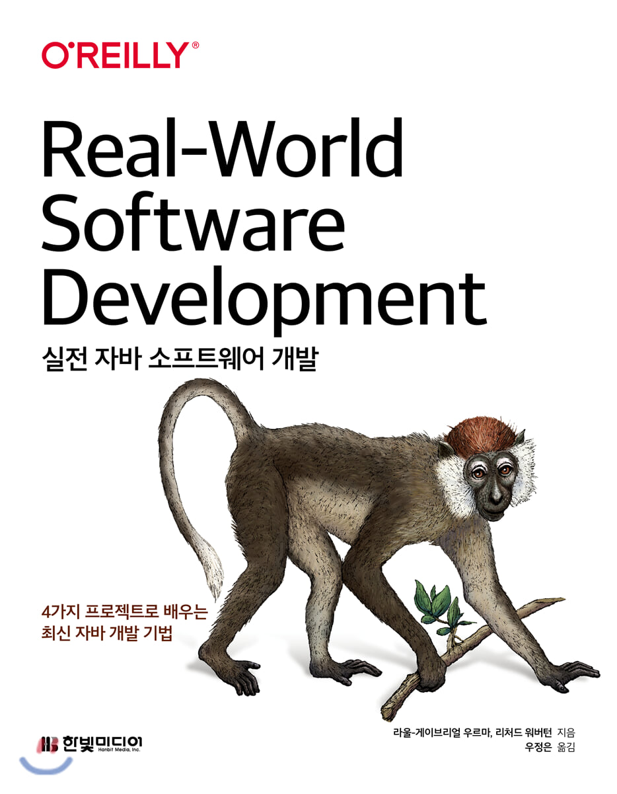

# 실전 자바 소프트웨어 개발
> 4가지 프로젝트로 배우는 최신 자바 개발 기법

# chapter_01 여행의 시작

* 배우게될 자바의 기능
  * 2장 클래스와 인터페이스 구조
  * 3장 예외와 패키지
  * 5장 지역 변수 형식 추론, switch
  * 7장 람다 표현식, 메서드 레퍼런스
    
* 배우게될 소프트웨어 디자인, 아키텍처
  * 2장 결합도, 응집도 (coupling, cohesion)
  * 3장 노티피케이션 패턴
  * 5장 플루언트(fluent) API, 빌더 패턴
  * 6장 이벤트 주도 아키텍처, 육각형 아키텍처
  * 7장 저장소(repository) 패턴, 함수형 프로그래밍

* SOLID
  * 2장 단일 책임 원칙 single responsibility principle SRP
  * 3장 개방/폐쇄 원칙 open/closed principle OCP
  * 4장 리스코프 치환 원칙 Liskov substitution principle LSP
  * 5장 인터페이스 분리 원칙 interface segregation principle ISP
  * 7장 의존관계 역전 원칙 dependency inversion principle DIP
  
입출금 내역 분석기, 문서 관리 시스템, 비즈니스 규칙 엔진, 트우터 프로젝트를 개발

# chapter_02 입출금 내역 분석기

* 단일 책임 원칙 SRP
* 응집도, 결합도
* KISS keep it short and simple 원칙

* 요구사항
  * 은행 입출금 내역의 총 수입과 총 지출은 각각 얼마인가? 결과가 양수인가 음수인가?
  * 특정 달엔 몇 건의 입출금 내역이 발생했는가?
  * 지출이 가장 높은 상위 10건은 무엇인가?
  * 돈을 가장 많이 소비하는 항목은 무엇인가?
    

* 코드 유지보수성이란?
  * 특정 기능을 담당하는 코드를 쉽게 찾을 수 있다
  * 코드가 어떤 일을 수행하는지 쉽게 이해할 수 있어야 한다
  * 새로운 기능을 쉽게 추가하거나 기존 기능을 쉽게 제거할 수 있어야 한다
  * 캡슐화가 잘 되어 있어야 한다. 즉 코드 사용자에게는 세부 구현 내용이 감춰져 있으므로 사용자가 쉽게 코드를 이해하고, 기능을 바꿀 수 있어야 한다

* 안티 패턴이란?
  * 한 개의 거대한 갓 클래스 때문에 코드를 이해하기가 어렵다
  * 코드 중복 때문에 코드가 불안정하고 변화에 쉽게 망가진다
    
* 단일 책임 원칙 SRP
  * 한 클래스는 한 기능만 책임진다
  * 클래스가 바뀌어야 하는 이유는 오직 하나여야 한다
  * 프로젝트에 적용 해본다면
    * 입력 읽기
    * 주어진 형식의 입력 파싱
    * 결과 처리
    * 결과 요약 리포트
    
* 놀람 최소화 원칙 principle of least surprise
  * 메서드가 수행하는 일을 바로 이해할 수 있도록 자체 문서화를 제공하는 메서드명을 사용한다
  * 코드의 다른 부분이 파라미터의 상태에 의존할 수 있으므로 파라미터의 상태를 바꾸지 않는다
  * 이는 약간 주관적인 개념이기에 동료, 팀원과 함께 의논하는 것이 좋다

* 응집도
  * 응집도란 클래스나 메서드의 책임이 서로 얼마나 강하게 연결되어 있는지를 측정
  * 클래스 수준 응집도. 실무에서는 아래 여섯 가지 방법으로 그룹화한다
    * 기능
      * 기능이 비슷한 메서드를 그룹화 
      * 기능 응집은 한 개의 메서드를 갖는 클래스를 과도하게 만들려는 경향이 발생할 수 있다
    * 정보
      * 같은 데이터나 도메인 객체를 처리하는 메서드를 그룹화. `BankStatementDAO` 클래스와 같이 네 개의 다른 메서드를 관련 정보로 응집하는 클래스를 구현한다 
      * 정보 응집은 일부 기능만 필요하더라도 클래스 전체를 디펜던시로 추가한다는 약점이 있다
    * 유틸리티
      * 관련성이 없는 메서드를 한 클래스에 포함시키거나, 어디에 속해야 할지 결정하기 어려울 때. 클래스가 상태가 아닌 행위만을 가질 때
    * 논리
      * `BankStatementFullParser` 클래스에서는 CSV, JSON, XML 을 '파싱' 한다는 논리로 그룹화하였다
      * 하지만 이 메서드들은 근본적으로 관련이 없다. 또한 여러가지 책임을 가지게 되므로 SRP 를 위배한다
    * 순차
      * 파일을 읽고, 파싱하고, 처리하고, 저장하는 메서드들을 한 클래스로 그룹화한다. 순차 응집은 여러 동작이 어떻게 함께 수행되는지 이해할 수 있다
      * 실전에서 순차 응집을 적용하면 SRP 를 위배하고, 클래스를 순식간에 복잡하게 만든다. 각 책임을 개별 클래스로 분리하는게 좋다
    * 시간
      * 여러 처리 작업을 시작하기 전, 후 로직을 담당하는 메서드를 그룹화한다
  * 응집도 수준
    * 기능(높음) > 정보(중간) > 순차(중간) > 논리(중간) > 유틸리티(낮음) > 시간(낮음)
  * 메서드 수준 응집도
    * 클래스 뿐만 아니라 메서드도 다양한 기능을 수행하고, 연관이 없는 여러 일을 처리하면 응집도가 낮아진다
    * 응집도가 낮은 메서드는 여러 책임을 포함하기 떄문에 각 책임을 테스트하기가 어렵다

